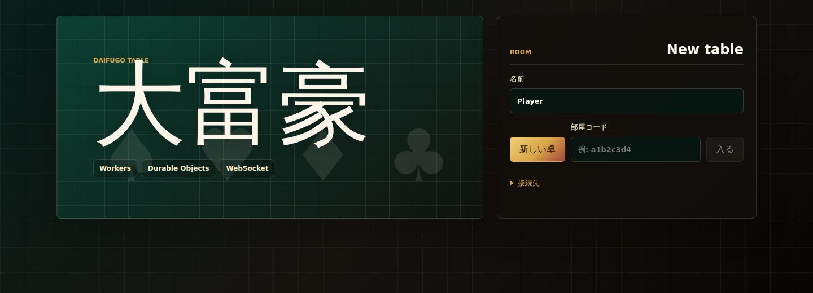
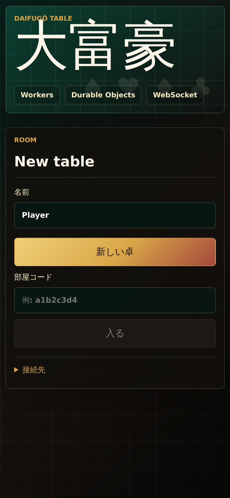

# 大富豪 Online

多人数で遊べる大富豪（President / Daifugō）の Web MVP です。Cloudflare Pages + Workers + Durable Objects で動かすことを想定し、公開リポジトリ前提で秘密情報を含めない構成にしています。

## Screenshots

### Desktop



### Mobile



## Features

- 部屋コードで同じ卓に参加
- WebSocket でリアルタイムに卓状態を同期
- ホストだけが開始、リセット、ルール変更を実行可能
- 再参加用 token を public state に出さない設計
- 320px 幅から崩れにくいレスポンシブ UI
- Unit test と Playwright E2E でルール、API、UI、モバイル表示を検証

## Stack

- UI: SvelteKit + Svelte 5（静的ビルド / Cloudflare Pages 想定）
- API: Hono on Cloudflare Workers
- Realtime state: Cloudflare Durable Objects + WebSocket
- Room index: Cloudflare KV（24h TTL の存在確認）
- Formatter / linter: Biome
- Unit tests: Vitest
- E2E tests: Playwright

## MVP rules

- 2人以上で開始
- 人数に応じてデッキ数を自動増加（8人ごとに1デッキ）
- ルールはロビーでON/OFF可能
- 同じ数字の複数枚出し
- 階段（同じマークの連番3枚以上）
- 場と同じ種類・枚数で、通常時はより強い数字、革命/11バック中はより弱い数字
- 縛り
- 8切り
- 革命 / 革命返し（4枚以上、5枚以上の階段）
- 11バック
- スペ3返し
- 5飛ばし
- 9リバース
- 反則上がり（Joker/2/8/J/スペ3返し）
- 全員パスで場流れ
- 手札がなくなった順に順位確定

今後候補: 7渡し、10捨て、都落ち、階級とカード交換、より細かいローカルルールプリセット。

## Local development

```bash
npm install
npm run dev:worker
npm run dev
```

UI で `API Base` に `http://127.0.0.1:8787`（ポートを変えた場合はその値）を入れて部屋を作成してください。

## Checks

```bash
npm run format
npm run check
npm run test:e2e
npm run audit:prod
npm run build
npx wrangler deploy --dry-run --outdir .wrangler/dry-run
```

`npm run ci` では format/type/unit/E2E/build/Worker dry-run までまとめて確認します。

## Test coverage

- `src/lib/game/engine.test.ts`: 大富豪のカード判定、ルール、ターン進行
- `src/lib/game/client.test.ts`: API client と WebSocket client の挙動
- `src/lib/server/room-object.test.ts`: Durable Object の room state と権限まわり
- `src/worker.test.ts`: Worker route、CORS、KV index、Durable Object forwarding
- `src/lib/components/mobile-layout.test.ts`: モバイル用 CSS の回帰テスト
- `tests/e2e/landing.spec.ts`: desktop/mobile の主要 UI と横スクロールなしの確認

## Mobile support notes

- iOS safe-area を考慮して shell の余白を調整
- 560px 以下ではカードを `clamp()` で縮小し、手札は横スクロール + scroll snap
- 操作ボタンは 48px 以上のタップ領域を確保
- モバイルでは場のアクションを sticky にして、縦スクロール中でも操作しやすくしています

## Cloudflare setup

1. KV namespace を作成して `wrangler.toml` の `ROOM_INDEX` に本番/preview ID を入れる
2. Worker API を deploy

```bash
npm run deploy:worker
```

3. Pages project を作成し、UI を deploy

```bash
npm run deploy:pages
```

Pages と Worker を同一ドメイン配下に置かない場合は、UI の `API Base` に Worker の URL を設定してください。

## Security notes

- 再参加には公開される `playerId` とは別の token を使います。token は `joined` event で本人にだけ返し、public room state には含めません。
- `start` / `reset` / `updateRules` はホスト接続からのみ実行できます。
- `play` / `pass` は参加済み接続からのみ実行できます。
- room id は8文字の `[a-z0-9_-]` のみ受け付け、KV index にない room は state/socket route で拒否します。
- CORS / WebSocket Origin は `daihugou.pages.dev`、preview Pages、localhost、127.0.0.1 を許可します。
